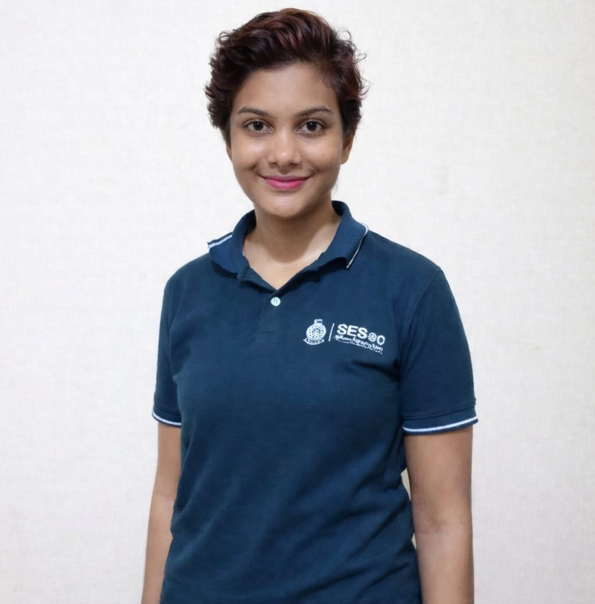

<h1 align="center">Hi 👋, I'm Sachini Rangika Alahakoon</h1>

  

---

## 👩‍🎓 About Me

- 🎓 Currently following a **Bachelor of Software Engineering** at the **Open University of Sri Lanka**
- 🎓 Done Advanced Level and Ordinary Level **Information and Communication Technology (ICT) Subject**
- 🎨 Diploma in **Graphic Design** from **Esoft Metro Campus**
- 🎓 Studying **ICT, Software Engineering, Graphic Design, AI, etc.,** for the past 11 years.
- 💻 Passionate about Software Engineering, QA Engineering, AI, UI/UX Design, and Creative Technologies

---

## 🔗 Connect With Me

- 💼 LinkedIn:  
  👉 https://www.linkedin.com/in/sachini-rangika-alahakoon-001065216/

---

## 🚀 Current Projects

### 📚 Student Management System (2025 February - 2026 March)

This project presents the development of a web-based Student Management System for Swarnamali Girls’ College, aimed at centralizing and securely managing academic and administrative operations through role-based access for administrators, teachers, and students, thereby improving operational efficiency and institutional decision-making.

**Tech stack:**

**Front-end:**  
- HTML  
- CSS  
- JavaScript  
- React  

**Back-end:**  
- Node.js  
- Express.js  

**Database:**  
- MySQL  

**UI Design:**  
- Figma  

**Testing Tools:**  
- Postman  

**Deployment:**  
- Web Server

**Team Members:**

- A.M.S.R. Alahakoon - Project Manager, Full-Stack Engineer, Technical Writer, and Business Analyst
- H.W.H.R. De Silva - Full-Stack Engineer,
- M.G.G.C.L. Dewasinghe - Front-end and Back-end developer
- U.L.W.G.L.D. Senavirathne - Backend Developer, Database Engineer, and API Tester
- M.M.F. Shakeera - Back-end developer, UI/UX Designer, and Technical Writer

### 📚 SachiGPT AI Counseling Chatbot (2025 August Present)
Beginner Level AI Self Project - **Still in the research phase**

SachiniGPT is an AI-powered counseling chatbot designed to provide a safe, supportive, and non-judgmental space for users to share their thoughts and emotions. The application aims to promote mental well-being by offering empathetic conversations, emotional support, and personalized guidance while encouraging users to seek professional help when necessary. It also includes features such as user profiles, chat history, and an intuitive interface to create an accessible and comforting user experience.

**Tech stack:**

- Frontend: React (Vite), HTML, CSS, JavaScript
- Backend: Python, FastAPI
- AI Integration: OpenAI API (GPT-based conversational AI)
- Database: MySQL
- API Testing: Postman
- UI/UX Design: Figma
- Version Control: GitHub
- Integrated Development Environment (IDE): PyCharm
- Deployment: Web server

---

## 🛠 Technical Skills

### 💻 Programming Languages
- Python  
- Java  
- C  
- JavaScript  

### 🌐 Web Development
- HTML  
- CSS  
- React  
- Node.js  
- Express.js  

### 📱 Mobile Development
- React Native  
- Android Studio  

### 🗄 Databases
- MySQL  
- SQL Server  

### 🎨 UI / UX Tools
- Figma  
- Balsamiq  

### 🖌 Graphic Design
- Adobe Photoshop  
- Adobe Illustrator  
- Adobe InDesign  

### ⚙ Other Tools
- GitHub  
- Postman
- Click Up Project Management Tool

---

## 🌟 Soft Skills
- Problem Solving  
- Critical Thinking  
- Leadership  
- Time Management  
- Multitasking  
- Teamwork  
- Creativity  
- Public Speaking  
- Project Management  

---

## 🌍 Languages
- English — Fluent  
- Sinhala — Fluent  
- Hindi — Conversational  
- Chinese — Basics
- Spanish — Basics
- Korean — Basics
- Tamil — Basics

---

## 🎓 Education

**Bachelor of Software Engineering Honours - The Open University of Sri Lanka (2021 Present)**

## 🛠 Technical Skills

### 💻 Programming Languages
- Python  
- Java  
- C  
- JavaScript  

### 🌐 Web Development
- HTML  
- CSS  
- React  
- Node.js  
- Express.js  

### 📱 Mobile Development
- React Native  
- Android Studio  

### 🗄 Databases
- MySQL  
- SQL Server  

### 🎨 UI / UX Tools
- Figma  
- Balsamiq  

### 🖌 Graphic Design
- Adobe Photoshop  
- Adobe Illustrator  
- Adobe InDesign  

### ⚙ Other Tools
- GitHub  
- Postman
- Click Up Project Management Tool

## 🌟 Soft Skills
- Problem Solving  
- Critical Thinking  
- Leadership  
- Time Management  
- Multitasking  
- Teamwork  
- Creativity  
- Public Speaking  
- Project Management

## 🛠 Other

- English Language
- Engineering Mathematics
- Accounting
- Economics
- Marketing
- Law

---

**Ordinary Level and Advanced Level Information Communication Technology - ICT (2015 - 2019)**

## 🛠 Technical Skills

- HTML
- CSS
- JavaScript
- Json
- XML
- Pascal
- Python
- MySQL
- MS Word
- MS PowerPoint
- MS Excel
- MS Access
- Audacity
- Operating Systems
- Computer Hardware
- Networking
- Number Systems
- Logic Gates
- Karnaugh Maps
- Boolean Terms
- Entity Relationship Diagram (ERD)
- Flow chart, Pseudo Code, Algorithm
- Database Management Systems

**Diploma in Graphic Design - Esoft Metro Campus (2021 January - 2022 January)**

## 🛠 Technical Skills

- Adobe Photoshop  
- Adobe Illustrator  
- Adobe InDesign

## 🌟 Soft Skills

- Time Management  
- Multitasking 
- Creativity

## 🛠 Other

- English Language
- Photography
- Videography

**Full-Stack Software Developer Program - University of Moratuwa (2022 January Present)**

## 🛠 Technical Skills

- Python Programming
- Web Development
- Project Management

---

⭐ *Thank you for visiting my profile!*
                                             
